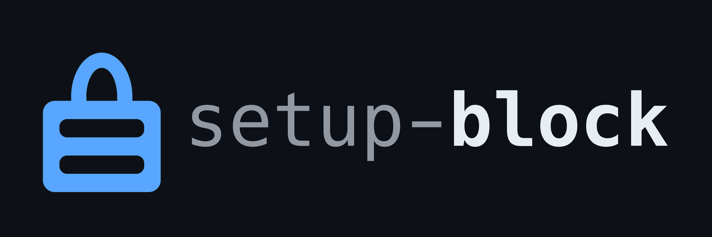

<!-- ALL-CONTRIBUTORS-BADGE:START - Do not remove or modify this section -->
[](#contributors-)
<!-- ALL-CONTRIBUTORS-BADGE:END -->

[](https://github.com/nao1215/setup-block/actions/workflows/test.yml)
[](https://github.com/nao1215/setup-block/actions/workflows/website.yml)


<p align="center">
  
</p>

GitHub Action that installs the [block](https://github.com/nao1215/block) CLI and restores its toolchain cache. block pins the blockchain CLI tools a project depends on — Foundry, geth, Lighthouse, Agave, Hermes and friends — so a repository gets the same toolchain on every machine and in CI. This action is the thin CI half of that: it installs a prebuilt `block` binary (no Go setup, no `go build`), caches `$BLOCK_HOME` on the lockfile, and optionally runs `block sync` so the tools are ready for the steps that follow.

Documentation: https://nao1215.github.io/setup-block/

## Quick start

```yaml
- uses: actions/checkout@v6
- uses: nao1215/setup-block@v0
  with:
    sync: "true"
- run: block exec forge test
```

That is the whole CI story: the toolchain in `block.lock` is installed, and
`block exec` runs your tools with it on `PATH`.

Without `sync`, the action only installs the CLI and leaves the timing to you:

```yaml
- uses: nao1215/setup-block@v0
- run: block sync
- run: block exec make test
```

The [cookbook](./doc/cookbook.md) has the rest — matrices across runners,
monorepo subdirectories, cache control, signature and provenance verification,
guarding the lockfile in a pull request, and reading a failure.

## Supported runners

Linux, macOS and Windows, on x86-64 and arm64 — every platform block itself
publishes a build for. Whether a given *tool* has a build for the runner you
chose is a separate question, answered by `block.lock`; block reports a
platform its lockfile does not cover rather than substituting something else.

## Pin a version

```yaml
- uses: nao1215/setup-block@v0
  with:
    version: v0.1.0        # "0.1.0" works too; "latest" is the default
```

## Caching

`$BLOCK_HOME` holds the downloaded artifacts and the unpacked tools. The
action caches it keyed by `block.lock`, so a workflow whose lockfile has not
changed re-uses the same store instead of downloading Foundry again:

```yaml
- uses: nao1215/setup-block@v0
  with:
    working-directory: contracts   # where block.toml and block.lock live
    sync: "true"
```

The cache key is the runner OS, its architecture and the hash of that
directory's `block.lock`. There are no partial-restore keys on purpose: block
verifies every artifact against the lockfile anyway, and a store restored from
a different lockfile would be mostly discarded. Turn it off with
`cache: "false"` if your workflow manages `$BLOCK_HOME` itself.

## Supply-chain checks

The downloaded archive is verified against `checksums.txt` by default. Two
stronger checks are available:

```yaml
- uses: sigstore/cosign-installer@v3
- uses: nao1215/setup-block@v0
  with:
    verify-signature: "true"     # cosign-verify checksums.txt (needs cosign)
    verify-attestation: "true"   # gh attestation verify (needs the gh CLI)
```

`verify-signature` checks the cosign bundle block publishes for
`checksums.txt`, which transitively covers every artifact listed in it.
`verify-attestation` checks the build provenance GitHub recorded for the
archive itself.

## Inputs

| Name | Default | Description |
| --- | --- | --- |
| `version` | `latest` | Version of block to install (`v0.1.0`, `0.1.0`, or `latest`). |
| `github-token` | `${{ github.token }}` | Token for API requests and downloads. Also exported as `GITHUB_TOKEN` for `block sync`. |
| `install-dir` | `$HOME/.block/bin` | Where the `block` binary is installed. |
| `verify-checksum` | `true` | Verify the archive against `checksums.txt`. |
| `verify-signature` | `false` | Verify `checksums.txt` with its cosign bundle. Requires `cosign`. |
| `verify-attestation` | `false` | Verify build provenance with `gh attestation verify`. Requires the `gh` CLI. |
| `add-to-path` | `true` | Add the install directory to `PATH` for later steps. |
| `block-home` | `~/.local/share/block` | The `$BLOCK_HOME` directory, exported for later steps. |
| `cache` | `true` | Cache `$BLOCK_HOME`, keyed by `block.lock`. |
| `working-directory` | `.` | Directory holding `block.toml` and `block.lock`. |
| `sync` | `false` | Run `block sync` after installing. |

## Outputs

| Name | Description |
| --- | --- |
| `version` | The resolved version that was installed (e.g. `v0.1.0`). |
| `bin-path` | Absolute path to the installed `block` binary. |
| `install-dir` | Directory the binary was installed into. |
| `block-home` | The `$BLOCK_HOME` exported for later steps. |
| `cache-hit` | `true` when the toolchain cache was restored exactly. Empty when caching is disabled. |

## What this action does not do

It installs `block` and gets out of the way. It never resolves versions, never
writes `block.lock`, and never installs a tool the lockfile does not name —
those are `block`'s own guarantees, and CI is exactly where they matter:

> `block sync` never resolves. `block exec` never installs. `block lock` is
> the only operation that can move a pin.

So there is no "update the toolchain in CI" input here. Moving a pin is a
change to `block.lock` that belongs in a pull request, which is what
`block lock --check` in a scheduled job is for:

```yaml
- uses: nao1215/setup-block@v0
- run: block lock --check   # exit 2 when a newer version is available
```

## Related

- [setup-block documentation](https://nao1215.github.io/setup-block/)
- [Cookbook](./doc/cookbook.md) — workflow steps indexed by task
- [block](https://github.com/nao1215/block) — the CLI this action installs
- [block-registry](https://github.com/nao1215/block-registry) — the tools block can install

## Contributing

Issues and pull requests are welcome; see [CONTRIBUTING.md](./CONTRIBUTING.md).
Contributions are not only about code: a GitHub Star also motivates
development.

## LICENSE

The setup-block project is licensed under the terms of [MIT LICENSE](./LICENSE).

## Contributors ✨

Thanks goes to these wonderful people ([emoji key](https://allcontributors.org/docs/en/emoji-key)):

<!-- ALL-CONTRIBUTORS-LIST:START - Do not remove or modify this section -->
<!-- prettier-ignore-start -->
<!-- markdownlint-disable -->
<table>
  <tbody>
    <tr>
      <td align="center" valign="top" width="14.28%"><a href="https://debimate.jp/"><br /><sub><b>CHIKAMATSU Naohiro</b></sub></a><br /><a href="https://github.com/nao1215/setup-block/commits?author=nao1215" title="Code">💻</a> <a href="https://github.com/nao1215/setup-block/commits?author=nao1215" title="Documentation">📖</a></td>
    </tr>
  </tbody>
</table>

<!-- markdownlint-restore -->
<!-- prettier-ignore-end -->

<!-- ALL-CONTRIBUTORS-LIST:END -->
